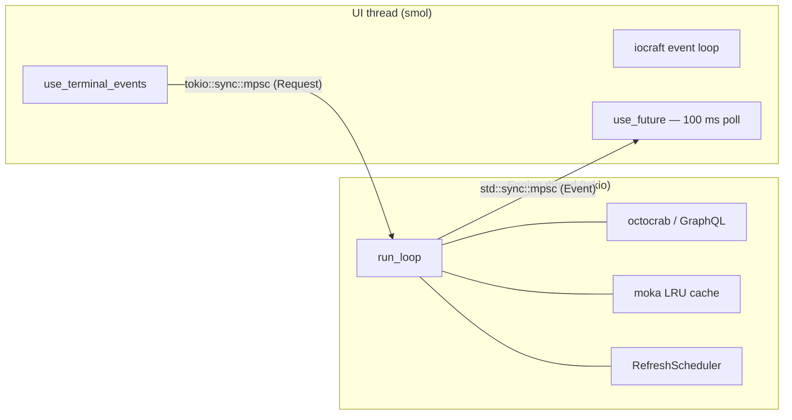
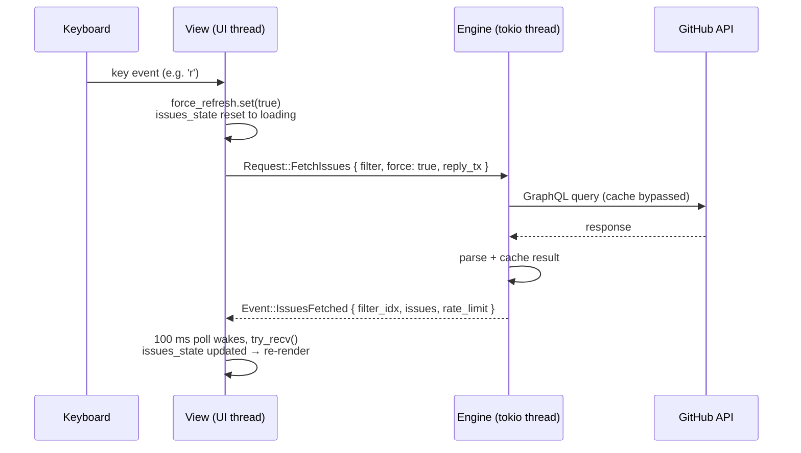
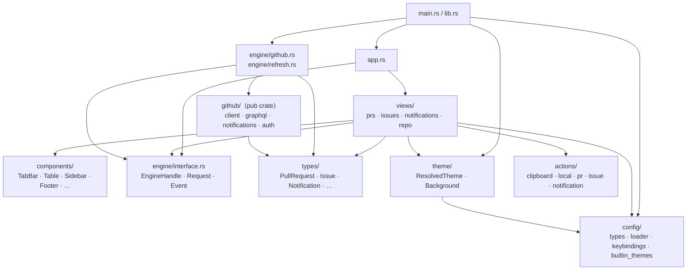

# Architecture

Coding conventions and prescriptive rules live in `CONVENTIONS.md`.
Runtime wiring, module map, and commands live in `CLAUDE.md`.

---

## Runtime / thread model

Two threads, two async runtimes — strictly isolated. No `async_compat` anywhere.

- **UI → Engine**: `tokio::sync::mpsc::UnboundedSender<Request>` inside
  `EngineHandle`. Calls are non-async (`engine.send(…)`).
- **Engine → UI**: one `std::sync::mpsc::Sender<Event>` per request, passed
  as `reply_tx`. Views drain it every 100 ms with `try_recv()`.
- Dropping `EngineHandle` closes the Request channel → engine's `run_loop`
  exits cleanly.

---

## Request → Event flow

A single user action, end to end.

The same shape applies to every mutation (`CloseIssue`, `AssignIssue`, …):
engine replies with `Event::MutationOk` or `Event::MutationError`, then the
view resets its filter and triggers a fresh fetch.

---

## Module dependency boundaries

Key boundaries:

- **`types/`** is the shared neutral ground — imported by both UI and engine,
  no dependencies on either side.
- **`github/`** is `pub(crate)` and may only be imported by `engine/github.rs`.
  Views never reach into `github/` directly.
- **`engine/interface.rs`** is the sole contract between the two threads:
  `EngineHandle`, `Request`, `Event`.
- **`components/`** is `pub(crate)`; views compose it but it knows nothing
  about views, engine, or config.
