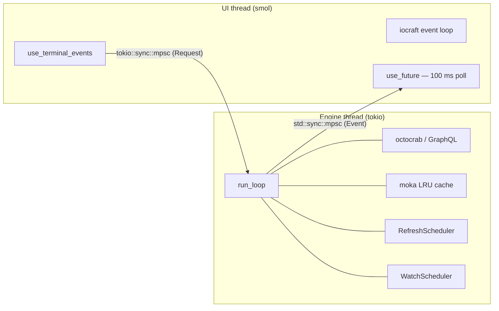
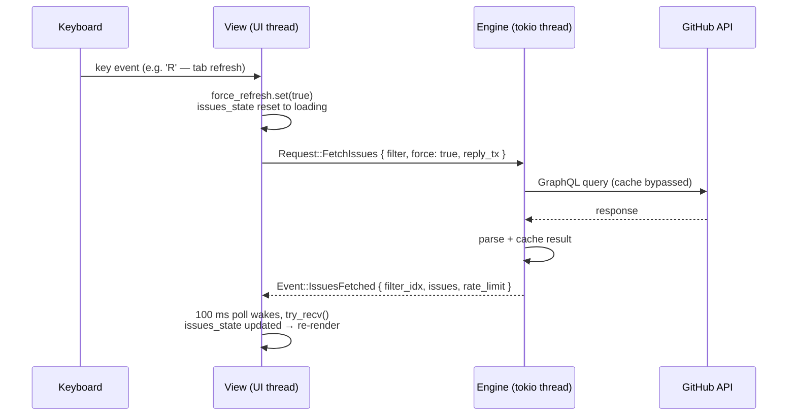
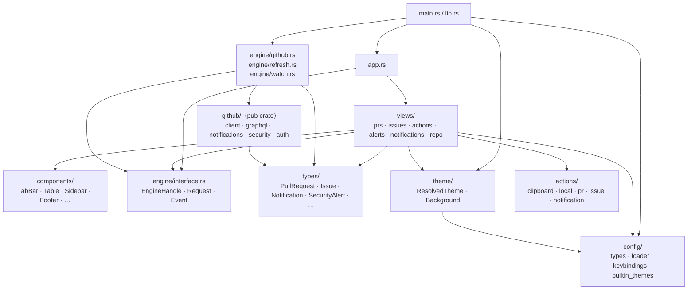

# Architecture

Coding conventions and prescriptive rules live in `CONVENTIONS.md`.
Runtime wiring, module map, and commands live in `CLAUDE.md`.

---

## Runtime / thread model

Two threads, two async runtimes — strictly isolated. No `async_compat` anywhere.

```mermaid
graph LR
    subgraph UI["UI thread  (smol)"]
        A[iocraft event loop]
        B[use_future — 100 ms poll]
        C[use_terminal_events]
    end

    subgraph ENG["Engine thread  (tokio)"]
        D[run_loop]
        E[octocrab / GraphQL]
        F[moka LRU cache]
        G[RefreshScheduler]
        H[WatchScheduler]
    end

    C -->|"tokio::sync::mpsc (Request)"| D
    D -->|"std::sync::mpsc (Event)"| B

    D --- E
    D --- F
    D --- G
    D --- H
```

- **UI → Engine**: `tokio::sync::mpsc::UnboundedSender<Request>` inside
  `EngineHandle`. Calls are non-async (`engine.send(…)`).
- **Engine → UI**: one `std::sync::mpsc::Sender<Event>` per request, passed
  as `reply_tx`. Views drain it every 100 ms with `try_recv()`.
- Dropping `EngineHandle` closes the Request channel → engine's `run_loop`
  exits cleanly.

---

## Request → Event flow

A single user action, end to end.

```mermaid
sequenceDiagram
    participant K as Keyboard
    participant V as View (UI thread)
    participant E as Engine (tokio thread)
    participant G as GitHub API

    K->>V: key event (e.g. 'R' — tab refresh)
    V->>V: force_refresh.set(true)<br/>issues_state reset to loading
    V->>E: Request::FetchIssues { filter, force: true, reply_tx }
    E->>G: GraphQL query (cache bypassed)
    G-->>E: response
    E->>E: parse + cache result
    E-->>V: Event::IssuesFetched { filter_idx, issues, rate_limit }
    V->>V: 100 ms poll wakes, try_recv()<br/>issues_state updated → re-render
```

Three refresh levels exist (`r` / `R` / `ctrl+r`):

- **`r` — `RefreshItem`**: refreshes only the selected item. For PRs and
    Issues the engine runs a single combined GraphQL query (`RefreshPr` /
    `RefreshIssue`) that returns both table-row and detail data, updating the
    row in-place across all filters. For Actions it pairs `FetchRunById` +
    `FetchRunJobs`. Notifications and Repo fall through to tab-level refresh.
- **`R` — `Refresh`**: resets the active filter tab and re-fetches all items.
- **`ctrl+r` — `RefreshAll`**: resets every filter tab.

The same shape applies to every mutation (`CloseIssue`, `AssignIssue`, …):
engine replies with `Event::MutationOk` or `Event::MutationError`, then the
view marks the filter as `loading` (keeping existing rows visible) and
triggers a lazy re-fetch.

The **Alerts** view issues three REST calls per filter tab (dependabot, code
scanning, secret scanning). Individual 403 errors are non-fatal — the engine
merges whatever succeeds and sends a single `AlertsFetched` event.

### Watch polling

`WatchScheduler` tracks workflow runs being watched (`W` key). The tokio
tick interval equals the configured `watch_poll_interval_seconds` (default
30). A 1-second tolerance in `due_entries` absorbs the delay between the
tick firing and `mark_polled` recording the wall clock after the API call,
preventing the effective period from doubling. When `watch_fetch_jobs` is
enabled, each tick also calls `fetch_run_jobs` so the sidebar updates live.

### Cross-view deep-links

Jumping from a PR to its Actions run (`ctrl+]`) creates a
`NavigationTarget::ActionsRun { owner, repo, run_id, host }`. The Actions
view's initial scan matches on both `run_id` and the filter tab's resolved
repo, preventing cross-repo mismatches in multi-repo setups.

### Sidebar meta header

`SidebarMeta` provides the pill badge, author, timestamps, and other
metadata rendered above the scrollable content. The `updated_label` field
lets each view customise the second date row: PRs/Issues use `"Updated:"`,
Actions uses `"Elapsed:"` (in-progress) or `"Duration:"` (completed).

---

## Module dependency boundaries

```mermaid
graph TD
    main["main.rs / lib.rs"]
    app["app.rs"]
    views["views/\nprs · issues · actions · alerts · notifications · repo"]
    components["components/\nTabBar · Table · Sidebar · Footer · …"]
    engine_iface["engine/interface.rs\nEngineHandle · Request · Event"]
    engine_impl["engine/github.rs\nengine/refresh.rs\nengine/watch.rs"]
    github["github/  ⟨pub crate⟩\nclient · graphql · notifications · security · auth"]
    types["types/\nPullRequest · Issue · Notification · SecurityAlert · …"]
    config["config/\ntypes · loader · keybindings · builtin_themes"]
    theme["theme/\nResolvedTheme · Background"]
    actions["actions/\nclipboard · local · pr · issue · notification"]

    main --> app
    main --> config
    main --> theme
    main --> engine_impl

    app --> views
    app --> engine_iface

    views --> components
    views --> engine_iface
    views --> types
    views --> config
    views --> theme
    views --> actions

    engine_impl --> engine_iface
    engine_impl --> github
    engine_impl --> types

    github --> types

    theme --> config
```

Key boundaries:

- **`types/`** is the shared neutral ground — imported by both UI and engine,
  no dependencies on either side.
- **`github/`** is `pub(crate)` and may only be imported by `engine/github.rs`.
  Views never reach into `github/` directly.
- **`engine/interface.rs`** is the sole contract between the two threads:
  `EngineHandle`, `Request`, `Event`.
- **`components/`** is `pub(crate)`; views compose it but it knows nothing
  about views, engine, or config.
